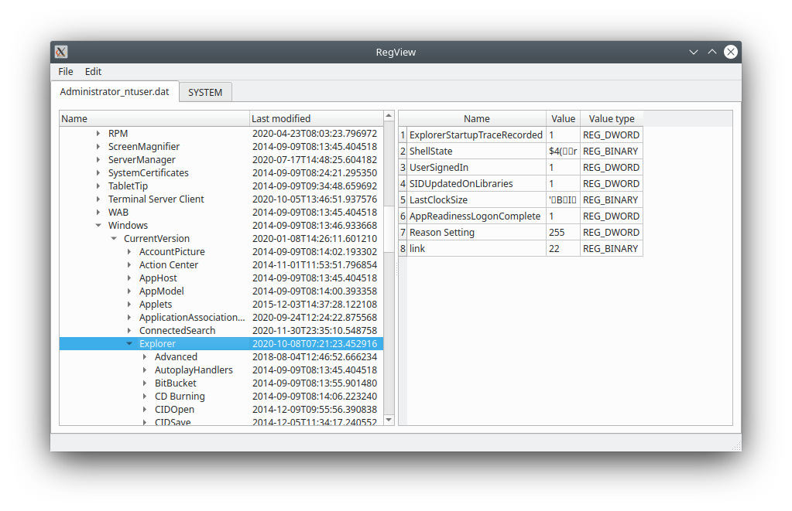

# RegView
Offline-Viewer for Windows Registry Files

## Screenshots



## Installation

```shell
# create a virtual environment
python3 -m venv venv

# activate virtual environment
source venv/bin/activate

# install required packages
pip3 install -r requirements.txt
```

## Usage

As this is a GUI-only tool, usage is simple:
```shell
# load virtual environment, unless you did that already
source venv/bin/activate

# start RegView
python3 regview.py
```

That's it ;-)
